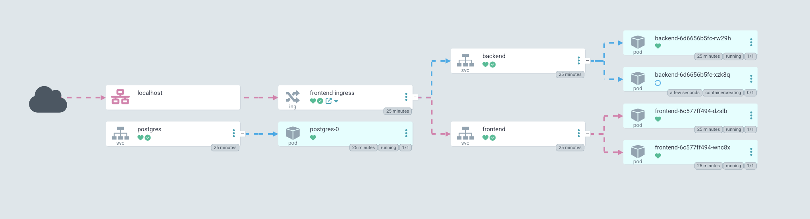

# DevSecOps Case Study
This repository corresponds to the work done during preparation for the final stage of selection proccess for DevSecOps Trainee position at Bawag. 

## 1. Overview

### 1.1 Objective
  To design and deploy a secure, automated Kubernetes development environment using KIND and GitOps, featuring separate dev, test, and prod namespaces. The goal is to implement a click counter demo app and enforce security best practices—such as RBAC, secret encryption, and vulnerability scanning—while managing everything declaratively via Git.

### 1.2 Key Features Implemented
  - Automated cluster setup with Terraform and KIND

  - Three namespaces: dev, test, prod

  - GitOps deployment via ArgoCD and Kustomize overlays

  - Click counter app (frontend, backend, PostgreSQL)

  - RBAC for namespace and ArgoCD access control

  - Sealed Secrets for encrypted sensitive data

  - TLS/HTTPS via cert-manager and Ingress

  - NetworkPolicies to restrict internal traffic

  - SecurityContext hardening for all pods

  - Shell scripts for full automation

  - Documentation with diagrams and screenshots

## 2. Infrastructure Setup

### 2.1 KIND Multi-Node Cluster via Terraform
As to emulate real life infrastructure setup and follow IaC (Infrastructure as Code) Terraform was used to create the cluster.
    
Possible use to manually run Terraform:

    terraform -chdir="../terraform" init
    terraform -chdir="../terraform" apply -auto-approve
### 2.2 Cluster Topology & Node Roles
As for better availability multi-node structure is required so 1 control and 2 worker nodes were created inside the cluster.
### 2.3 Namespace Structure: dev, test, prod
To simulate real enviroments 3 namespaces were created for 3 intended enviroments: dev, test and prod
Differences:
| Namespace | Purpose         | Replicas (App Pods) | Resource Limits (CPU/Memory) |
|-----------|-----------------|---------------------|------------------------------|
| dev       | Development     | 1                   | Low      |
| test      | QA/Testing      | 3                   | High  |
| prod      | Production      | 3                   | High   |

### 2.4 Ingress Controller Setup (NGINX)
The Ingress Controller was installed for ArgoCD exposure as well as for main application ingress management. 
### 2.5 TLS Certificates with cert-manager
Cert-manager is used to issue appropriate certificates for both argoCD and main application to enhance security through SSL cerificates.
### 2.6 Automation Scripts
Scripts in the scripts folder as well as makefile to consolidate them are used to have documented version of the infrastructure setup and cluster configuration.  

## 3. GitOps Workflow

### 3.1 Git Repository Structure
The repository has 4 branches:
 - main - all infrastructure and cluster manifests 
 - dev, test, prod for deploying application to corresponding namespaces

### 3.2 Kustomize: Base and Overlays
Kustomize was used to patch the application manifests .
The actual structure of the repository corresponds to the base being the common manifests across different enviroments and overlay being custom configuration based on the enviroment its running it:

        ├── manifests
        │   ├── base
        │   │   ├── backend-deployment.yaml
        │   │   ├── backend-service.yaml
        │   │   ├── frontend-deployment.yaml
        │   │   ├── frontend-service.yaml
        │   │   ├── kustomization.yaml
        │   │   ├── network-policy.yaml
        │   │   └── postgres-statefulset.yaml
        │   └── overlays
        │       ├── frontend-ingress.yaml
        │       ├── kustomization.yaml
        │       ├── patch-backend.yaml
        │       ├── patch-frontend.yaml
        │       ├── rbac
        │       │   ├── dev-role-binding.yaml
        │       │   ├── dev-role.yaml
        │       │   └── dev-service-account.yaml
        │       └── sealed-postgres-dev.yaml

        
### 3.3 ArgoCD Configuration & Applications
ArgoCD tracks three branches in the repository and deploys changes to the corresponding environment.

### 3.4 Promotion Strategy
As a suggestion and practice to be followed the following promotion strategy for the new feature implementations should follow through  (dev → test → prod) pipeline conducting QA and checks before promoting changes to new enviroment.

### 3.5 ArgoCD Chart
The following screenshot represent the structure of the application as seen on argoCD UI:

 

## 4. Application Architecture
### 4.1 Demo App Overview (Click Counter)
The demo application is a classic three-tier web app designed to demonstrate GitOps workflows, secure deployment, and infrastructure automation. Users interact with a web interface that displays a button; each click is counted and persisted. The architecture separates concerns into frontend, backend, and database services, deployed as independent pods within Kubernetes. All communication is secured, and deployment is fully declarative.

### 4.2 Frontend Details
The frontend is a lightweight React application served via an NGINX container. It provides a simple, responsive user interface for the click counter and communicates with the backend API over HTTPS. The frontend container image is built and published to Docker Hub, and deployed via Kubernetes Deployment and Service resources. Ingress routes HTTPS requests to the frontend, enabling secure, browser-based access.
Frontend demo:

### 4.3 Backend Details
The backend is a Node.js Express server responsible for handling API requests from the frontend and updating the click count in the database. It exposes REST endpoints (/api/count, /api/click) for retrieving and incrementing the click value. The backend securely connects to the Postgres database using credentials managed by Sealed Secrets, and is deployed as a stateless Deployment with resource limits and security context set.

### 4.4 Database Setup with Postgres (StatefulSet)
As a db solution Postgres was chosen implemented as StatefulSet with attached PVC to keep the data persistent. Sealed Secrets were used for login credentials.
### 4.5 Ingress and Service Configuration
The Ingress for the application exposes the port 443 as the external access. Frontend and backend communicate through ingress while backend and postgres are communicating through internal communication.
### 4.6 Dockehub Images
Images were created with Docker and published to Dockerhub repository. To publish new version scripts/image-publish-*.sh could be used.
## 5. Security Design
### 5.1 Kubernetes RBAC (dev, test, prod)

A minimal RBAC setup was implemented: one admin role per environment, with access restricted to that namespace.

| Namespace | Role       | Permissions                  | Subjects          |
|-----------|------------|------------------------------|-------------------|
| dev       | dev-user  | Full access in dev namespace | DevOps, Dev team  |
| test      | test-user | Full access in test namespace| QA, DevOps        |
| prod      | prod-user | Full access in prod namespace| SRE, DevOps       |

Each namespace is isolated, and users have full control only within their respective environment.

### 5.2 ArgoCD RBAC & Policy Mapping

Default ArgoCD RBAC roles were used.

| Role      | Permissions                        | Assigned To    |
|-----------|------------------------------------|----------------|
| admin     | Full access to all ArgoCD features | DevOps         |
| read-only | Can only view applications         | Developers     |

Admins can manage and sync applications, while developers have read-only access to monitor deployments.

### 5.3 Sealed Secrets Implementation
The secret there sealed using bitnami secret controller offering advance solution to secret handling compared to default solution. Secrets are sealed using the controller so that they cannot be decrypted without it. This allows to push sealed secrets to the cluster without risking an exposure.
### 5.4 Network Policies
The Deny-all default config were introduce to reduce potential threats. Fine-grained networks policies were introduced as well.  
### 5.5 Pod & Container Hardening

Containers run as non-root users wherever possible.
- Pod Security Standards (restricted) are enforced.
- Images are built from minimal, official, and regularly updated base images.
- Read-only root filesystem is set where feasible.
- Unnecessary capabilities are dropped.
- SecurityContext is configured to disallow privilege escalation.

### 5.6 TLS and Encrypted Communication
TLS is enforced for all external ingress traffic (port 443), ensuring encrypted communication between clients and the application. Internal communication between services can also be encrypted if supported. Certificates are managed using cert-manager. Sensitive data in transit (e.g., database connections) is protected via SSL/TLS.

## 6. How to Run the Whole Setup
### 6.1 Start up
To start up the cluster, use:

    make all
as well as commands from sections 6.2 and 6.3, 6.4to create secrets and argocd. Once argocd is up, and secrets are in place you can synchronise the app and it should be running.

To destroy cluster, you can run:

    make clean
### 6.2 Secret Creation
First create secret for your env:

    kubectl create secret generic postgres-secret-dev \
      --namespace dev \
      --from-literal=POSTGRES_DB=changeme \
      --from-literal=POSTGRES_USER=changeme \
      --from-literal=POSTGRES_PASSWORD=changeme \
      --dry-run=client -o yaml > postgres-secret-dev.yaml
    
Then, seal with kubeseal:

    kubeseal --controller-namespace kube-system --format yaml < postgres-secret-dev.yaml > sealed-postgres-secret-dev.yaml

Move it to the branch for your enviroment in overlay folder(change dev in names for other values)
### 6.3 ArgoCD credentials
To get admin password you can run this command on cluster:

    kubectl get secret argocd-initial-admin-secret -n argocd -o jsonpath="{.data.password}" | base64 --decode
### 6.4 Local DNS
For correct redir and local functioning add this to your /etc/hosts:

    127.0.0.1       argocd.local
    127.0.0.1       click.dev.local
    127.0.0.1       click.test.local
    127.0.0.1       click.prod.local

## 7. Conclusion

### 7.1 Achievements
- Automated secure multi-node Kubernetes setup with KIND and Terraform.
- GitOps deployment workflow using ArgoCD and Kustomize.
- Isolated dev, test, prod namespaces with RBAC and NetworkPolicies.
- Deployed a full-stack click counter app with encrypted secrets and TLS.

### 7.2 Potential Improvements

- **Integrate CI/CD**: Use [GitHub Actions](https://docs.github.com/en/actions) for auto-building and deployment.
- **Add image scanning**: Integrate [Trivy](https://aquasecurity.github.io/trivy/) for container vulnerability scans in CI.

- **Monitor cluster health**: Set up [Prometheus](https://prometheus.io/docs/introduction/overview/) & [Grafana](https://grafana.com/docs/grafana/latest/getting-started/getting-started-prometheus/).
- **Improve logging**: Add [ELK Stack](https://www.elastic.co/guide/en/elastic-stack/current/index.html) for app logs.

## 8. Used Resources

- [Kubernetes Documentation](https://kubernetes.io/docs/)
- [KIND - Kubernetes IN Docker](https://kind.sigs.k8s.io/)
- [Terraform Docs](https://developer.hashicorp.com/terraform/docs)
- [ArgoCD Docs](https://argo-cd.readthedocs.io/en/stable/)
- [Kustomize Docs](https://kubectl.docs.kubernetes.io/references/kustomize/)
- [Bitnami Sealed Secrets](https://github.com/bitnami-labs/sealed-secrets)
- [Cert-Manager Docs](https://cert-manager.io/docs/)
- [NGINX Ingress Controller](https://kubernetes.github.io/ingress-nginx/)
- [ReactJS Docs](https://reactjs.org/)
- [ExpressJS Docs](https://expressjs.com/)
- [PostgreSQL Docs](https://www.postgresql.org/docs/)
- [DockerHub Repository Backend](https://hub.docker.com/repository/docker/danilgutak/click-backend/general)
- [DockerHub Repository Frontend](https://hub.docker.com/repository/docker/danilgutak/click-frontend/general)
